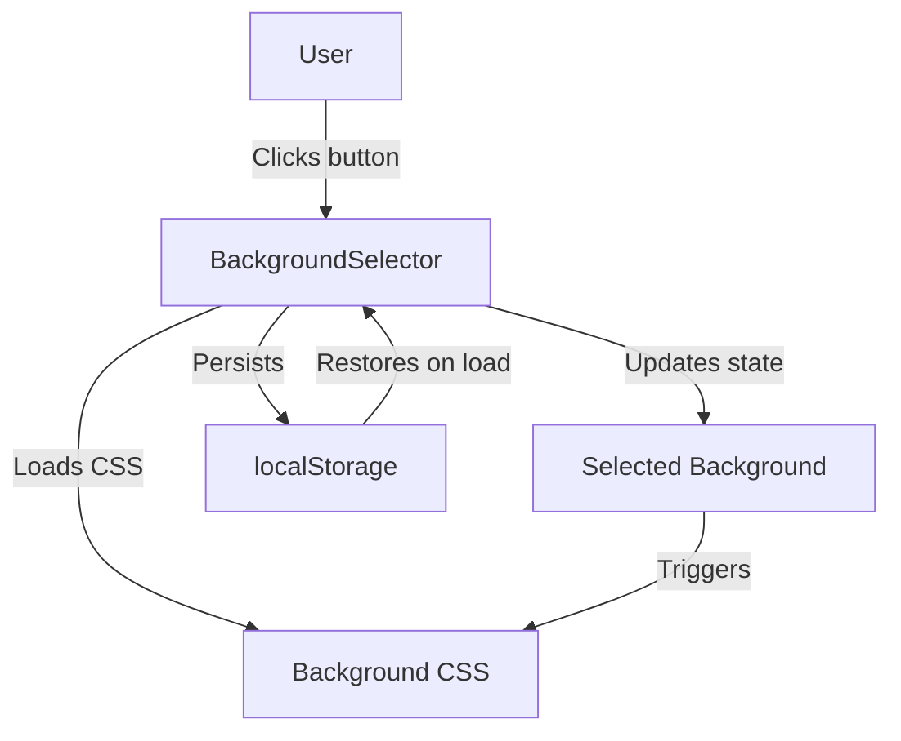
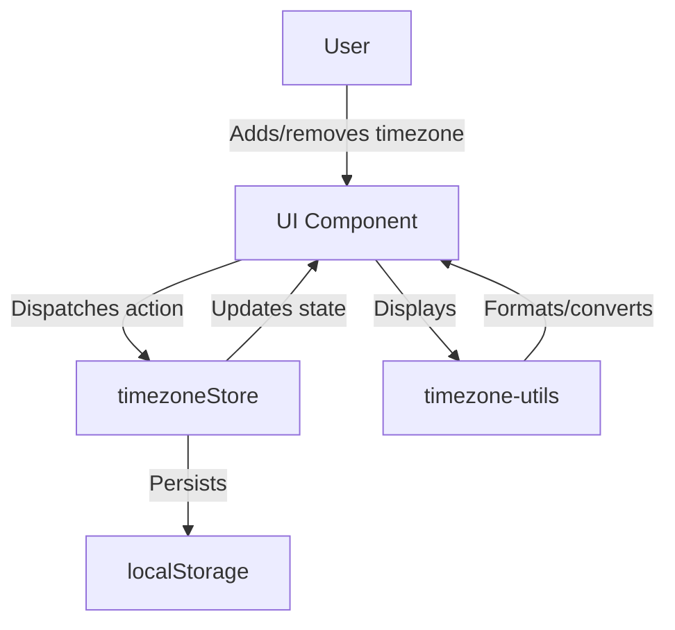

# CodeMap Root

timestamp: 2024-06-09T00:00:00Z {level: metadata}

## ACTIVE_MEMORY
- Components: []
- Decisions: []
- Patterns: []
- Tasks: []

## PROJECT_STRUCTURE
[project_root]/
  components/ [UI]
    BackgroundSelector.tsx
    MarsTimeExplanation.tsx
    StatusIndicator.tsx
    MobileMenu.tsx
    GlassmorphismAnimation.tsx
    DevInfo.tsx
    ThemeToggle.tsx
    [views/]
    [layout/]
    [mobile/]
    [events/]
    [clock/]
    [dev/]
    [ui/]
    [performance/]
    [seo/]
    [error/]
  app/ [CORE]
    layout.tsx
    globals.css
    providers.tsx
    page.tsx
    manifest.ts
    metadata.ts
    sitemap.ts
    robots.ts
    not-found.tsx
    loading.tsx
    font.ts
    HeadingMCP.tsx
    sentry.tsx
    error.tsx
    [current-events/]
    [components/]
    [api/]
    [contexts/]
    [mobilev2/]
    [grid-test/]
    [home/]
    [list-view/]
    [about/]
    [@fonts/]
  store/ [STATE]
    timezoneStore.ts
  lib/ [UTIL]
    timezone-utils.ts
    utils.ts
    [hooks/]
    [utils/]
  types/ [TYPES]
    react-native.d.ts
    react-simple-maps.d.ts
  public/ [ASSETS]
    og-image.png
    icon.png
    manifest.json
    apple-icon.png
    apple-icon-72x72.png
    apple-icon-114x114.png
    twitter.PNG
    perseverance.png
    mars.png
    timezonepulse.png
    total-cleanup.js
    sw.js
    favicon.ico
    [screenshots/]
    [shortcuts/]
    [icons/]
    [scripts/]
    [images/]
  memory_docs/ [DOCS]
    codeMap_root.md
    activeContext.md
    projectbrief.md
    productContext.md
    systemPatterns.md
    techContext.md
    progress.md
    decisions.md
  indexes/ [INDEXES]
    (to be created)
  tasks/ [TASKS]
    (to be created)

## FLOW_DIAGRAMS

### Background Selection Flow

### Timezone Management Flow

<!-- Add flow diagrams here as mermaid blocks --> 