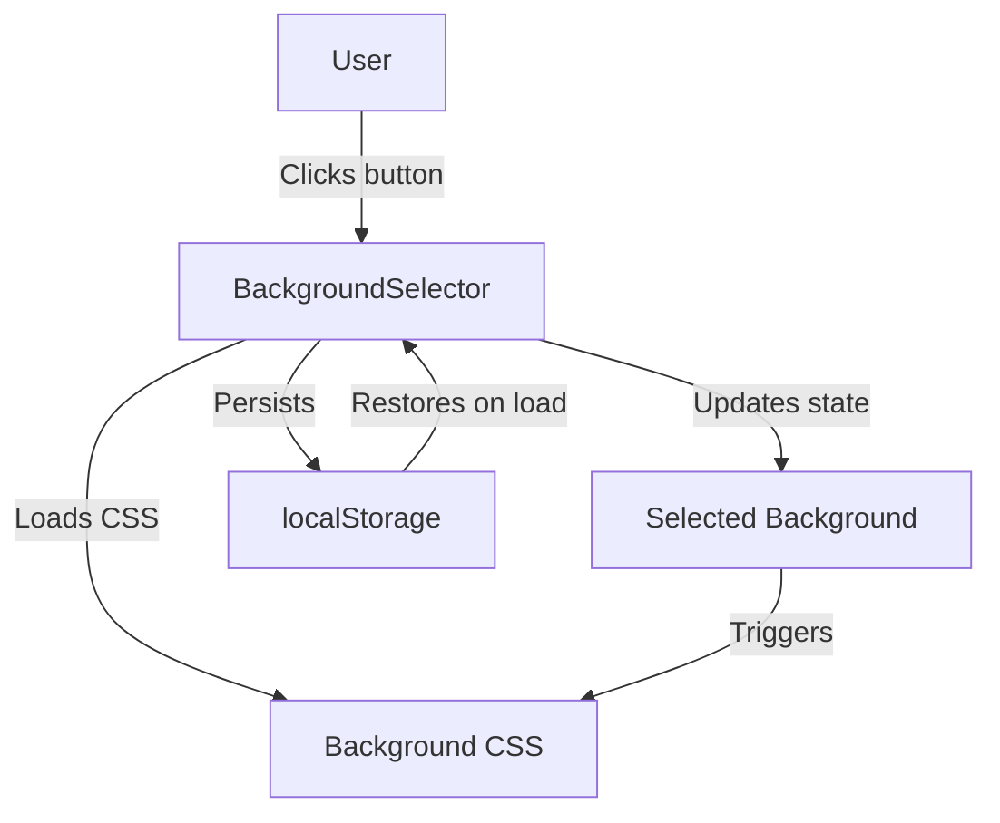
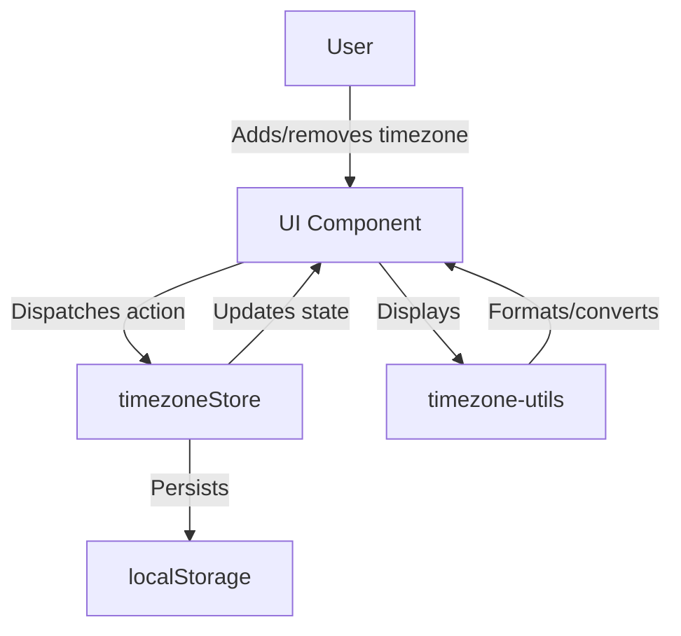
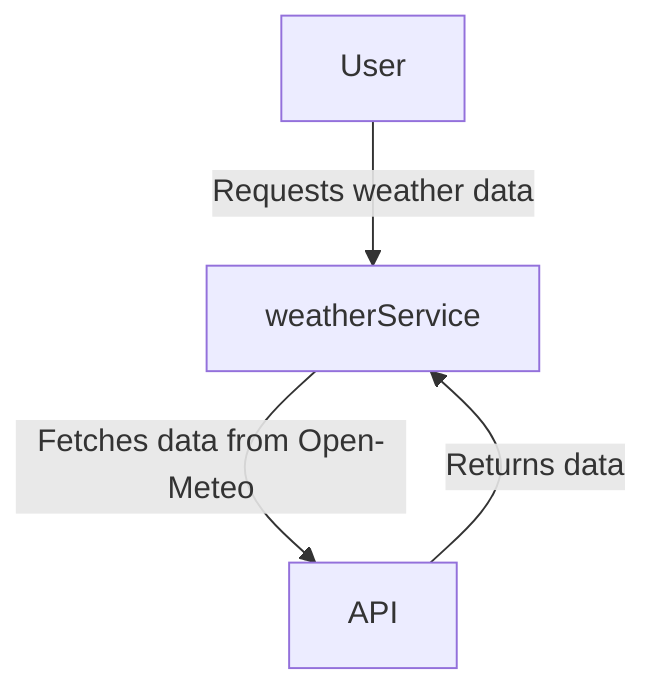
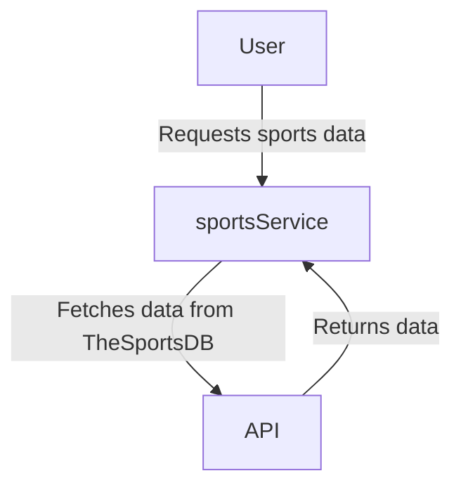
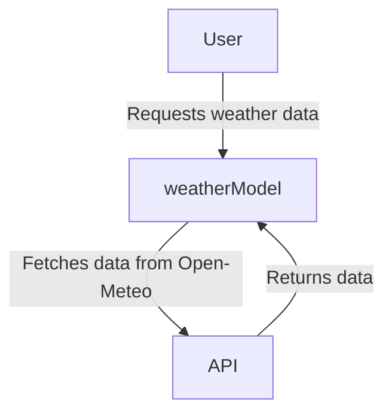
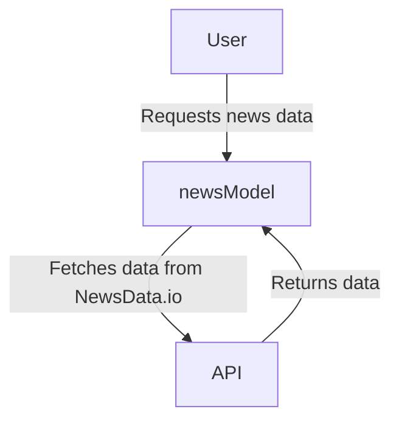
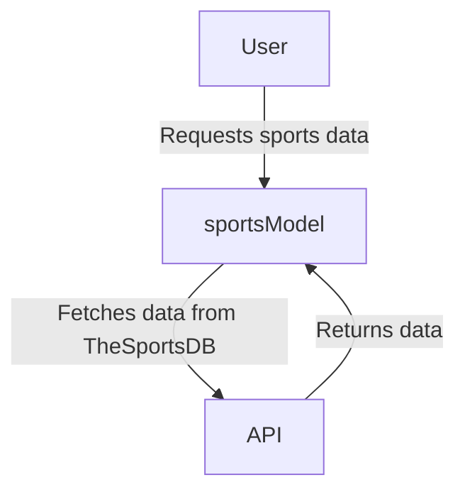

# CodeMap Root

timestamp: 2025-04-09T10:00:00Z {level: metadata}

## ACTIVE_MEMORY
- Components: None (TASK_004 Completed)
- Decisions: [#PRUNE_001]
- Patterns: @TBD
- Tasks: []

## PROJECT_STRUCTURE
[root_directory]/
  [app_directory]/ [CORE]
    [grid-test_directory]/ #[GRID_TEST] "Grid Test Feature" @index[components] @pruned @tasks[TASK_004]
  [ad_directory]/ #[AD] "Advertisement Content" @index[misc] @pruned @tasks[TASK_004]
  [SECURITY_directory]/ #[SECURITY] "Security Documentation" @index[misc] @pruned @tasks[TASK_004]
  [playwright-report_directory]/ #[PLAYWRIGHT_REPORT] "Testing Reports" @index[misc] @pruned @tasks[TASK_004]
  [next_directory]/ #[NEXT_BUILD] "Build Artifacts" @index[build] @retained @tasks[TASK_004]
  Lighthouse Report.html #[LIGHTHOUSE_REPORT] "Performance Report" @index[reports] @pruned @tasks[TASK_004]
  localhost_2025-03-30_02-25-09.report.html #[LOCAL_REPORT] "Local Performance Report" @index[reports] @pruned @tasks[TASK_004]
[project_root]/
  components/ [UI]
    BackgroundSelector.tsx
    MarsTimeExplanation.tsx
    StatusIndicator.tsx
    MobileMenu.tsx
    GlassmorphismAnimation.tsx
    DevInfo.tsx
    ThemeToggle.tsx
    Sidebar.tsx #[UI_SIDEBAR] "Sidebar navigation and actions" @index[components] ^critical @tasks[TASK_002]
    ui/date-picker.tsx #[UI_DATE_PICKER] "Popup calendar date picker (glassmorphism, sidebar-matching)" @index[components] @tasks[TASK_002] @pattern[@Glassmorphism]
    ui/calendar.tsx #[UI_DATE_PICKER] "Calendar element (glassmorphism, sidebar-matching)" @index[components] @tasks[TASK_002] @pattern[@Glassmorphism]
    [views/]
    [layout/]
    [mobile/]
    [events/]
    [clock/]
    [dev/]
    [ui/]
    [performance/]
    [seo/]
    [error/]
    eventsSection.tsx #[UI_EVENTS_SECTION] "Events section for timezone card" @patterns[TabPanel] @tasks[TASK_003]
    tabWeather.tsx #[UI_TAB_WEATHER] "Weather tab button" @index[components] @tasks[TASK_003]
    tabNews.tsx #[UI_TAB_NEWS] "News tab button" @index[components] @tasks[TASK_003]
    tabSports.tsx #[UI_TAB_SPORTS] "Sports tab button" @index[components] @tasks[TASK_003]
    filterBar.tsx #[UI_FILTER_BAR] "Filter bar for events section" @patterns[FilterBar] @index[components] @tasks[TASK_003]
    panelWeather.tsx #[UI_PANEL_WEATHER] "Weather panel content" @index[components] @tasks[TASK_003]
    panelNews.tsx #[UI_PANEL_NEWS] "News panel content" @index[components] @tasks[TASK_003]
    panelSports.tsx #[UI_PANEL_SPORTS] "Sports panel content" @index[components] @tasks[TASK_003]
  app/ [CORE]
    layout.tsx
    globals.css
    providers.tsx
    page.tsx
    manifest.ts
    metadata.ts
    sitemap.ts
    robots.ts
    not-found.tsx
    loading.tsx
    font.ts
    HeadingMCP.tsx
    sentry.tsx
    error.tsx
    [current-events/]
    [components/]
    [api/]
    [contexts/]
    [mobilev2/]
    [grid-test/]
    [home/]
    [list-view/]
    [about/]
    [@fonts/]
  store/ [STATE]
    timezoneStore.ts
  lib/ [UTIL]
    timezone-utils.ts
    utils.ts
    [hooks/]
    [utils/]
  types/ [TYPES]
    react-native.d.ts
    react-simple-maps.d.ts
  public/ [ASSETS]
    og-image.png
    icon.png
    manifest.json
    apple-icon.png
    apple-icon-72x72.png
    apple-icon-114x114.png
    twitter.PNG
    perseverance.png
    mars.png
    timezonepulse.png
    total-cleanup.js
    sw.js
    favicon.ico
    [screenshots/]
    [shortcuts/]
    [icons/]
    [scripts/]
    [images/]
  memory_docs/ [DOCS]
    codeMap_root.md
    activeContext.md
    projectbrief.md
    productContext.md
    systemPatterns.md
    techContext.md
    progress.md
    decisions.md
  indexes/ [INDEXES]
    (to be created)
  tasks/ [TASKS]
    (to be created)

## FLOW_DIAGRAMS

### Background Selection Flow

### Timezone Management Flow

<!-- Add flow diagrams here as mermaid blocks --> 

## SERVICES

### Weather Service

### News Service

### Sports Service

## MODELS

### Weather Model

### News Model

### Sports Model
